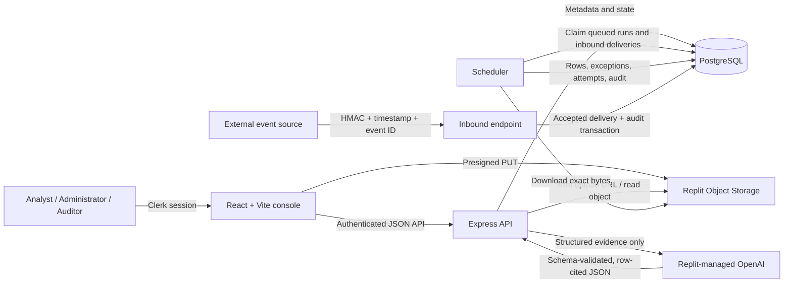

# Architecture

## System flow

## Main components

- `artifacts/operations-evidence-console` is the browser application. Clerk supplies identity; generated API hooks manage server state.
- `artifacts/api-server` owns authorization, tenant scope, upload URL minting, processing claims, summaries, approvals, and audit reads.
- `lib/db` contains the PostgreSQL schema and Drizzle client.
- `lib/api-spec`, `lib/api-zod`, and `lib/api-client-react` keep the HTTP contract, runtime validation, and frontend client aligned.
- Replit Object Storage holds uploaded bytes. The database stores object paths and processing evidence.
- The scheduler processes queued/stuck runs and accepted inbound deliveries with bounded work and cancellation.

## Trust boundaries

1. **Identity:** Clerk identity is mapped to an organisation member before protected API access.
2. **Tenant isolation:** server queries include the authenticated organisation ID; client-side filtering is not trusted.
3. **Uploads:** the browser receives a write-capable URL only after server authentication, role checks, and metadata validation.
4. **Inbound events:** HMAC verification uses the exact raw request body. Freshness and replay checks run before processing.
5. **Model output:** only structured ingested evidence is sent to the model. Returned JSON must match the strict schema and cite supplied rows.
6. **Consequential actions:** action types are allowlisted, administrator approval is required, and self-approval is blocked.
7. **Audit integrity:** action state, durable effects, and audit evidence commit transactionally. Database triggers reject audit updates, deletes, and truncation.
